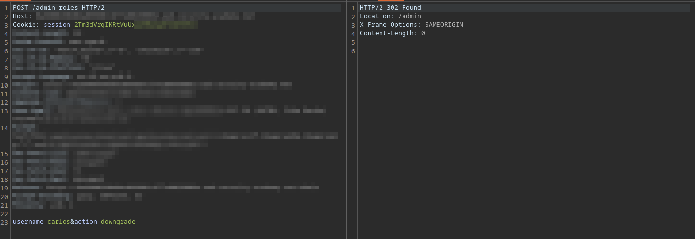

# LAB: Method-based access control can be circumvented

## Given:

- Credentials for administrator user `adminstrator: admin`.
- Credentials for wiener user `wiener: peter`.

## Objective:

- Give `weiner` user admin priveleges.

## Key Concepts:

- sometimes, the backend applications tolerate multiple method request for same endpoint, which can result in method circumvention.

## Steps Taken:

1. Load the target website.
2. Intercept the requests using Burp Proxy.
3. Go to my acount page
4. Login with `administrator: admin`.
5. Open the admin-panel page.
6. Upgrade any user other then `wiener`.
7. Observe through Burp proxy that an API call is made to `/admin-roles` endpoint.



8. Send the `/admin-roles` request to repeater.
9. Log in with `weiner: peter`.
10. Copy the session value of user wiener and paste in the `/admin-roles` request in repeater.


11. Change the request parameter to upgrade the `wiener` user to admin.


12. Send the request to change the `weiner` user to admin using POST & GET methods.
13. The see as the GET method gives an error that `username` parameter is not defined.


14. Try again but this time with `PUT` method.

.

15. `302` response code is returned means the request was complete.
16. The `weiner` user is now upgraded to admin priveleges just because the appication had broken HTTP method access control vulnerability.
17. The lab is solved.

## Payloads Used:

```http
session: weiner user session value
username=wiener&action=upgrade
```

## Payload explanation:

- The `/admin-panel` endpoint is not secured properly.
- It accepts the upgrade/downgrade requests even from non-admin users through `PUT` HTTP method.
- We first logged in with the `administrator` account to get the endpoint to make a user admin or non-admin.
- Then we logged in with the user we need to give admin priveleges. Which is `weiner`.
- Use `weiner`'s session to send request to give this user admin priveleges.
- Try with multiple methods like the most popular such as `GET`, `POST`, `PUT`.
- The application was accepting the `PUT` request which ulitmately resulted in vertical privelege exploitation.

## Takeaways:

- Always use all HTTP methods for any API endpint to see if its not handling authentication and allowing access for a specific HTTP method.
