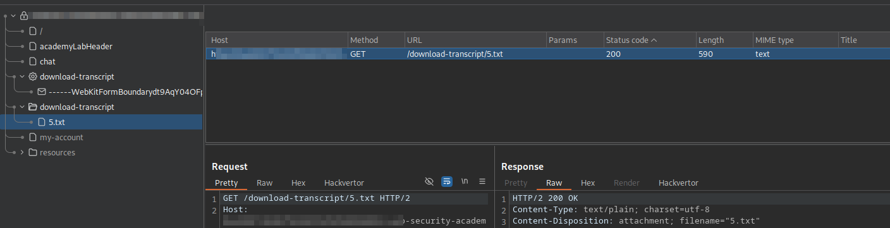
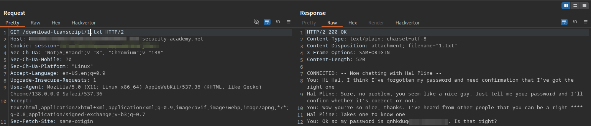

# LAB: Insecure direct object references

## Given:

- Chat logs are stored on the server and are accessible via static URLs.
- The application does not enforce proper access controls on transcript downloads, allowing users to enumerate and access other users' chat logs.

## Objective:

- Retrieve the password for user `carlos` by exploiting insecure direct object reference (IDOR) in the chat transcript download functionality, and use it to log in as `carlos`.

## Key Concepts:

- **Insecure Direct Object Reference (IDOR):** Occurs when an application exposes a reference to an internal object (such as a file or record) and fails to enforce proper authorization, allowing attackers to manipulate the reference and access unauthorized data.
- **Horizontal Privilege Escalation:** Exploiting weaknesses in access controls to access resources or data belonging to other users at the same privilege level.
- **Static Resource Enumeration:** Testing for predictable or sequential resource identifiers (e.g., `1.txt`, `2.txt`) to discover sensitive files or data.
- **Professional Security Testing:** Involves systematically reviewing all endpoints, especially those serving files or data, and attempting to enumerate or manipulate identifiers to uncover access control flaws.

## Steps Taken:

1. **Proxy Setup:** Load the target website in Burp Suite's Chromium browser to intercept and analyze all HTTP traffic.
2. **Navigate to Live Chat:** Access the Live Chat page within the application.
3. **Download Own Transcript:** Download the chat transcript as a baseline for understanding the request structure.

   

4. **Analyze Requests:** In Burp Suite's Site Map, identify the `GET` request responsible for downloading chat transcripts.

   

5. **Send to Repeater:** Send the transcript download request to Burp Suite Repeater for manual testing and manipulation.
6. **Parameter Manipulation:** Change the transcript file path in the request (e.g., from `/download-transcript/2.txt` to `/download-transcript/1.txt`) to attempt access to other users' transcripts.

   

7. **Review Response:** The server responds with the contents of another user's chat transcript, which includes sensitive information such as the password for user `carlos`.
8. **Extract Credentials:** Copy the password for `carlos` from the transcript.
9. **Login as Carlos:** Navigate to the login page and authenticate as `carlos` using the extracted password.
10. **Verify Access:** Confirm successful login as `carlos` and complete any remaining lab objectives.
11. **Lab Completion:** The lab is successfully solved, demonstrating the impact of the IDOR vulnerability.

## Payloads Used:

```http
/download-transcript/1.txt
```

## Issues Encountered:

- No issues encountered during exploitation. The vulnerability was straightforward to identify and exploit using Burp Suite's interception and manual testing features.

## Takeaways:

- **Enumerate and Test All Endpoints:** Always review endpoints that serve files or data for predictable patterns and test for IDOR vulnerabilities by manipulating identifiers.
- **Never Rely on Obscurity:** Static or sequential URLs are easily guessable and should never be used as the sole means of access control.
- **Implement Robust Authorization:** Enforce strict server-side authorization checks for every request, especially those serving sensitive data or files.
- **Professional Practice:** Regularly audit applications for access control weaknesses, and ensure sensitive information is never exposed through predictable or unprotected endpoints.
- **Security Controls:** Use indirect references (such as securely generated tokens) for resource access, and validate user permissions on every request to prevent unauthorized data exposure.
