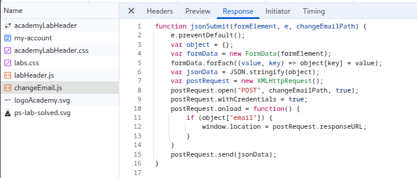

# LAB: User role can be modified in user profile

## Objective:

- Escalate privileges by setting `roleid = 2` for the user `wiener:peter` to gain admin access and delete the user `Carlos`.

## Key Concepts:
- **Insecure Direct Object Reference (IDOR):** The server trusts user-supplied data in the profile update request, allowing privilege escalation.
- **AJAX Requests:** Profile updates are handled via AJAX, sending JSON payloads to the backend.
- **Parameter Tampering:** Additional parameters (like `roleid`) can be injected into requests if not properly validated server-side.
- **Burp Suite Proxy:** Essential for intercepting and modifying HTTP requests/responses.

## Steps Taken:

1. Load the target website.
2. Navigate to **my account** page.
3. Login with given credentials `wiener: peter`.
4. Open networks tab and update the account email.
5. Observe that there is a **_changeEmail.js_** file which send an `AJAX` request and returns a `json` response.
   
6. **Proxy** the traffic in **Burp Suite** and update the account email.
7. Analyze the reponse of the _change-email_ `POST` request response.
   
8. As the **_changeEmail.js_** file submits the whole formData to the server, we can pass other data as well to update.
9. Update the request payload to not only include the email but also set the `roleid =2`.
   
10. Submit the request.
11. Observe the response that `email` and `roleid` both are changed.
12. The lab is solved.

## Payloads Used:

```json
{
    "email:"updated@gmail.com",
    "roleid":"2"
}
```

## Issues Encountered:

- Unable to find the response for the `AJAX` request made by _**changeEmail.js**_ script file.

## Solutions/Workarounds:

- Used Burp Suite Proxy to capture and analyze all API calls, including those not visible in the browser's developer tools.

## Takeaways:

- **Always inspect network traffic** for hidden or undocumented API endpoints.
- **Use interception proxies** (like Burp Suite) to uncover and manipulate requests not visible in browser tools.
- **Test for parameter tampering** by adding or modifying parameters in API requests.
- **Privilege escalation vulnerabilities** can often be found in poorly validated profile update endpoints.
- **Thoroughly review request/response pairs** for any fields that can be abused for privilege escalation.
