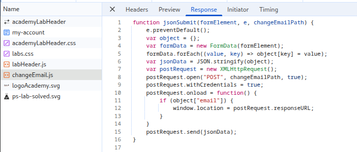

# LAB: User role can be modified in user profile

## Objective:

- Set the `roleid = 2` for the given user `wiener: peter` to access the `/admin` page and delete the user `Carlos`.

## Key Concepts:

## Steps Taken:

1. Load the target website.
2. Navigate to **my account** page.
3. Login with given credentials `wiener: peter`.
4. Open networks tab and update the account email.
5. Observe that there is a **_changeEmail.js_** file which send an `AJAX` request and returns a `json` response.
   
6. **Proxy** the traffic in **Burp Suite** and update the account email.
7. Analyze the reponse of the _change-email_ `POST` request response.
   
8. As the **_changeEmail.js_** file submits the whole formData to the server, we can pass other data as well to update.
9. Update the request payload to not only include the email but also set the `roleid =2`.
   
10. Submit the request.
11. Observe the response that `email` and `roleid` both are changed.
12. The lab is solved.

## Payloads Used:

```json
{
    "email:"updated@gmail.com",
    "roleid":"2"
}
```

## Issues Encountered:

- Unable to find the response for the `AJAX` request made by _**changeEmail.js**_ script file.

## Solutions/Workarounds:

- Used Burp proxy to find all the API calls.

## Takeaways:

- Always explore the application by using the networks tab to monitor any useful API calls.
- Use Burp Proxy to catch all the calls that are not sustained and visible in browser networks tab.
- Always check request & response of each API call to find any additional parameters that can be manipulated.
