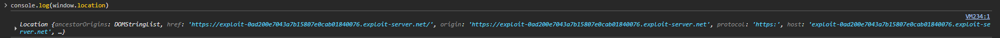

# LAB: Reflected XSS into HTML context with all tags blocked except custom ones

## Objective:

- Find a way to inject a malicious payload into the site as most of the tags are blocked by WAF.
- `alert` the `document.cookie` of the target website.

## Key Concepts:

- **Reflected XSS**: Injecting malicious scripts that are immediately reflected and executed in the browser.
- **WAF Tag Filtering**: Web Application Firewalls may block standard HTML tags but sometimes allow custom or less common tags.
- **Custom HTML Tags**: Browsers allow unknown/`custom tags`, which can be used to bypass tag-based filters.
- **Event Handler Attributes**: Attributes like `onfocus` can execute JavaScript when triggered, even on `custom tags`.
- **Burp Suite Intruder**: Useful for automating the discovery of which tags and attributes are allowed by the filter.
- **Exploit Delivery**: Using an exploit server to deliver a crafted URL to a victim for real-world exploitation.

## Steps Taken:

1. Load the target website.
2. Submit a POC payload with inline script execution such as **payload 1**.
3. Observe that the WAF blocks the tag.
   
4. Use Burp Suite's **intruder** feature to find the list of allowed tags.
5. Observe that the `custom tags` are allowed along with some `animation` related tags.
   
6. As we are provided the information that no attributes are blocked. Therefore, we can use `custom tag` payloads such as **payload 2**, as POC.
7. Submit the `payload 2` in the search field and observe that the alert is indeed displayed on the screen.
8. As we are provided with an **Exploit Server**, which means we have to deliver a _phishing link_ to the victim. Copy the `URL` with the `payload 2` submitted, and paste it in the **payload 3** in the **Exploit Server** and deliver to victim.
9. The lab is solved.

## Payloads Used:

```html
<!--Payload 1-->


```

```html
<!--Payload 2-->

<xss autofocus onfocus="alert(document.cookie)" tabindex="1" />
```

```html

<!--Payload 3-->

  <script>
    location =
      "https://0a99009e04ca7bf180e10df70047001b.web-security-academy.net/?search=%3Cxss%20autofocus%20onfocus=alert(document.cookie)%20tabindex=1%20%3E%3C/xss%3E";
  </script></xss
>
```

**NOTES:**

- We can use the location variable, which is a global window object variable, that points to the current URL of the website.
  

## Issues Encountered:

- `<animate>` tag payloads were not working although the `<animate>` tag is allowed.

```html
<rect width="10" height="'10">
  <animate attributeName="href" values="javascript:alert(document.cookie)" />
</rect>
```

## Solutions/Workarounds:

- Always try the `custom tag` POC payload first, using the `autofocus` attribute and `onfocus` event.

## Takeaways:

- If `custom tags` are allowed and apparently, no attribute is blocked, always try with `autofocus` payload if it works before going to allowed built-in tags.
- Always enumerate which `tags` and `attributes` are allowed when facing a `WAF`.
- `Custom tags` can be used to bypass tag-based restrictions if event handler attributes are not filtered.
- The `autofocus` and `onfocus` combination is a reliable XSS vector when `custom tags` and attributes are allowed.
- Automated tools like Burp Suite `Intruder` can speed up the process of finding bypasses.
- Understanding browser parsing behavior is crucial for exploiting XSS in restricted environments.
